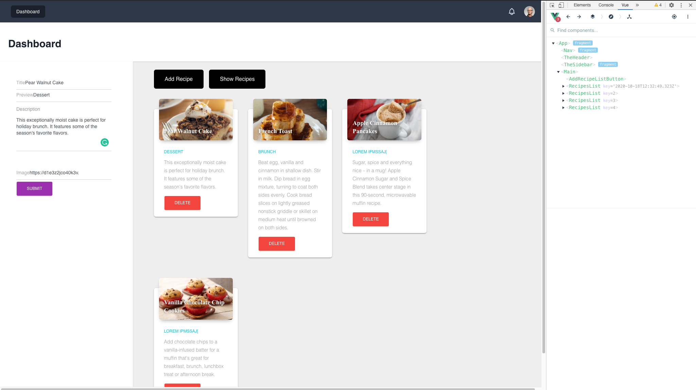

# vue3-foodpin


## Basic Features 
This is a basic Vue3 Web application that will be built on 
to increase the features of this application in the new future. 
- Dyanmic Components & Attribute Fallthrough 
- Props 
- Provide | Inject
- Teleport 
- Forms (fetching the user input using $refs)

## Project setup
```
yarn install
```

### Compiles and hot-reloads for development
```
yarn serve
```

### Compiles and minifies for production
```
yarn build
```

### Lints and fixes files
```
yarn lint
```

### Customize configuration
See [Configuration Reference](https://cli.vuejs.org/config/).
